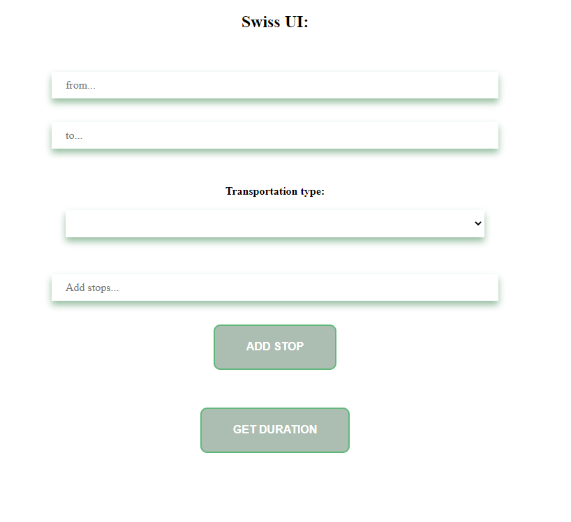
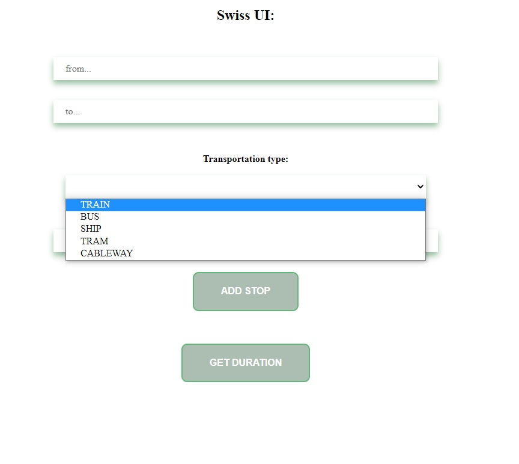
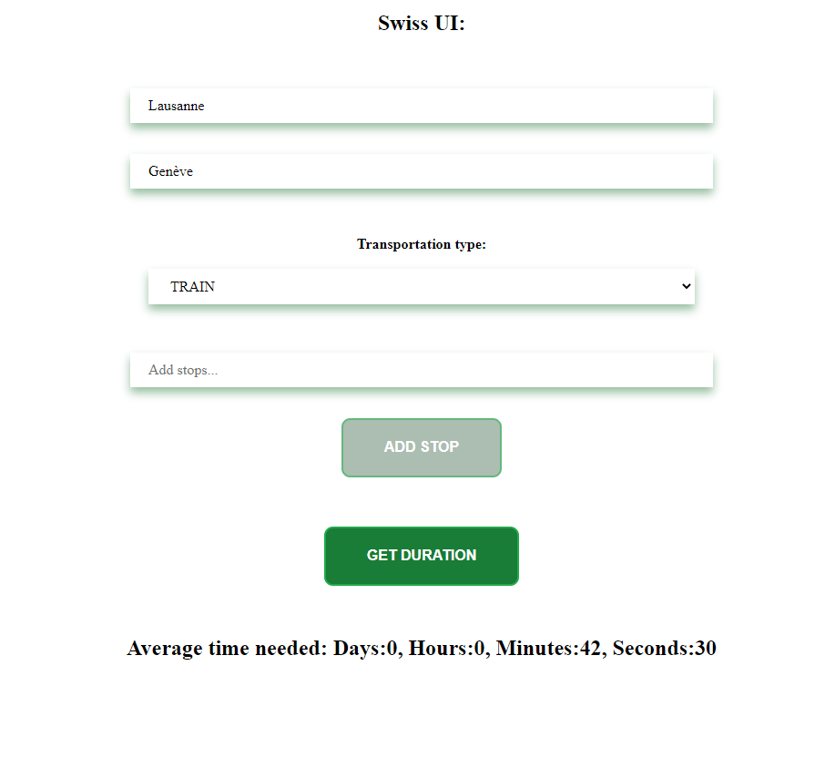
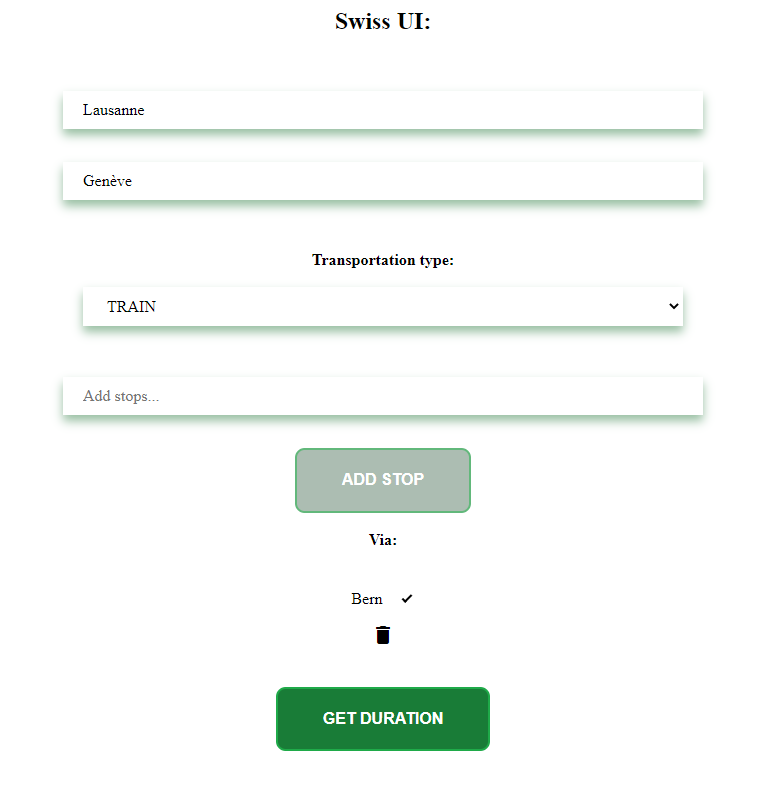
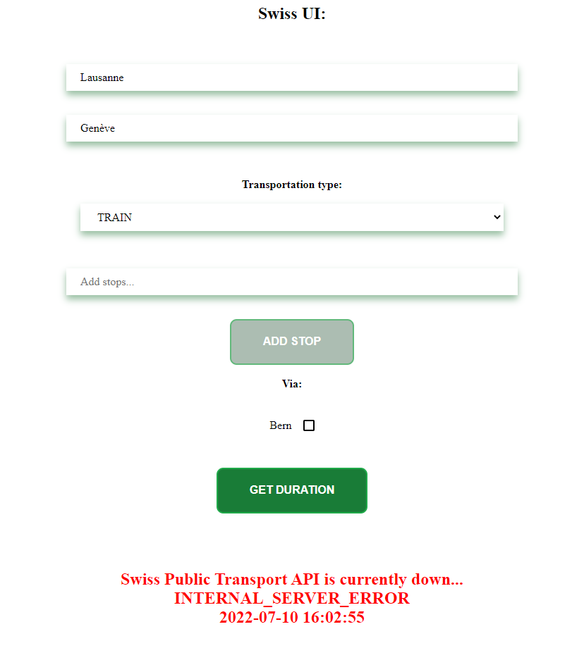
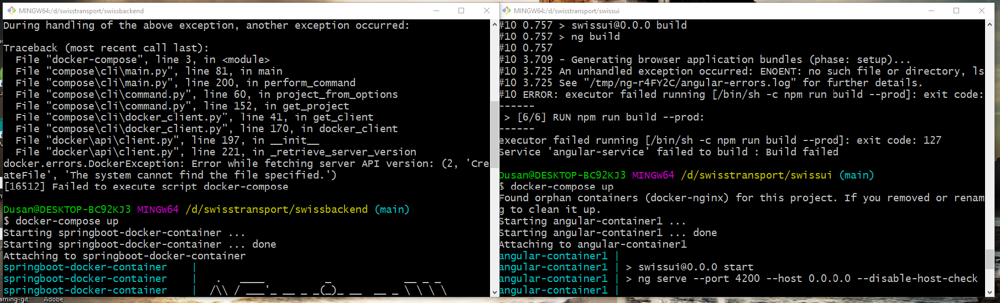

# Swiss Transport Tool

## Overview
This project is made for the purpose of completing coding challange issued by TX Services to
me (Dusan Batinica) as a part of a selection process. Swiss Transport Tool allows the user to enter two
locations in Switzerland (two cities) and receive the average duration that it would take to get from
point A to point B (location from -> locatio to), given the transportation means, and "check" point (aka stops).
Since there are more departure and arrival time pairs the application will take the average and display it.
API allows to reduce the JSON results to relevant fields, but allows limited amount of checkpoints (5 max).
## Technical Details
Application consists of backend part and frontend part. Backend part was written in Java programming 
language used in conjunction with Spring Boot framework. Frontend part was built
using Angular framework. Backend side has a Rest Controller class that receive request from the frontend
that is providing relevant information. Controller sends the request over to Service which uses
dedicated parser classes to respond to the request. The request is sent to Swiss Public Transport
API according to information provided by the user via RestTemplate, and is stored in a dedicated class.
Once the information is collected TimeParser will calculate the duration and the response will be sent
back to the user. Errors are handled via ExceptionHandler class that sends over error message, error status and timestamp back to frontend.
No results for particular transport type will yield no results on the screen.

## Entites of note
ConnectionDTO - class that stores JSON data sent from UI

DurationDTO - object that contains actual duration that is passed over to the UI

Connection - class that ConnectionDTO is being mapped to

ConnectionController - used to receive requests from UI and send back the response

ConnectionService - receives requests passed by controller, utilizes other dedicated classes to give back the response

ApiResponse - object used to store response from Swiss Public Transport API

SwissApiParser - generates request for Swiss Public Transport API based upon data user entered

TimeParser - parses the response received from Swiss Public Transport API and send back the result

ConnectionExceptionHandler - class used to handle exceptions

## Example
 ### UI form (no interaction)

 ### Choosing transportion means

 ### Getting average time needed to get from point A to B

 ### Adding "checkpoint" to go through (can be deleted via trash bin)

 ### Receiving error that can happen

## Running and interacting with app
You can run the application via docker-compose files that are present withing each part of
the application. Install Docker if you do not have it, navigate to each particular folder
swissui and swissbackend, open Git Bash in it, run command "docker-compose up" in each terminal. Your
app should be up and running. Go to http://localhost:4201/ and the UI form should pop up.
Alternatively you can use Postman to send the requests to backend. Use POST request with http://localhost:8081/api/v1/connections.
There might be issues with CORS policy resulting in inability for fronted to communicate with the backend. It is recommended for you to install, and
enable chrome plugin (https://chrome.google.com/webstore/detail/allow-cors-access-control/lhobafahddgcelffkeicbaginigeejlf?hl=en) to bypass that issue.

### Postman body example: 
{
    "locationFrom": "Lausanne",  
    "locationTo":"Genève",   
    "transportation": "TRAIN"
}

### Terminals (starting docker compose files)

## Sidenote
There were issues with Swiss Public Transport API during weekend as it was down. Error is handled by the application
but if that problem continues, it will result in application sending back error response as shown in the screenshot above.
## Contributors
- Dušan Batinica - batinicadusan819@gmail.com (business mail)
